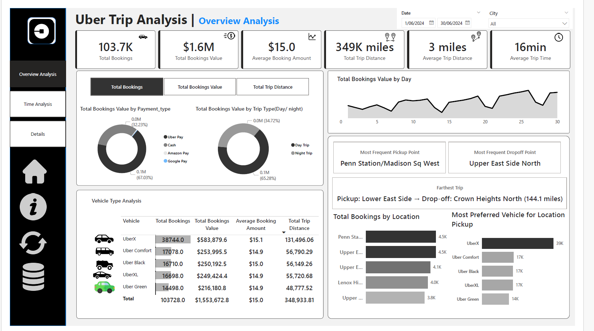
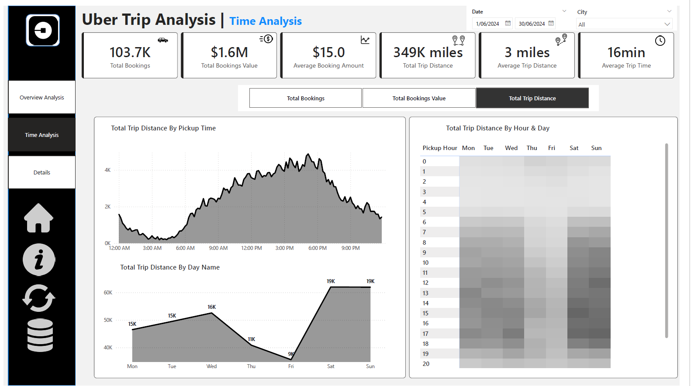
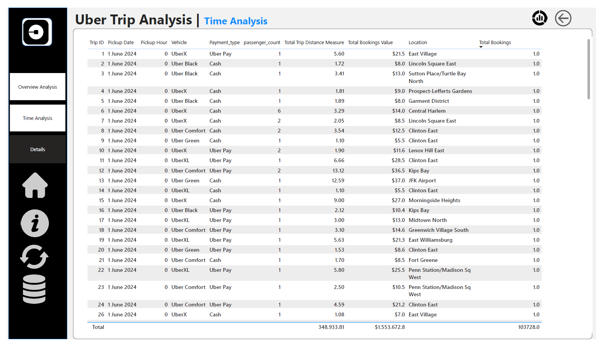

# 🚖 Uber Trip Analytics Dashboard

## 📌 Overview
End-to-end Power BI analytics project analyzing 100,000+ real-time 
Uber rides from New York City (June 2024).

## 📊 Dashboard Pages
- **Overview Analysis** – KPIs, payment types, vehicle performance, daily trends
- **Time Analysis** – Peak demand heatmap by hour/day, 10-minute interval trends  
- **Details Grid** – Drill-through to granular ride-level data

## 🛠️ Tools & Technologies
- Power BI Desktop (Dashboards, DAX, Bookmarks, Drill-through)
- DAX (USERELATIONSHIP, TOPN, RANKX, SUMMARIZE, CONCATENATEX)
- Power Query (Data profiling, quality checks)
- Excel (Fact table + Location dimension table)
- Star Schema Data Modeling

## 🖼️ Dashboard Preview

## 💡 Key Features
- Dynamic parameter switch for Total Bookings / Revenue / Trip Distance
- Active & inactive relationships for pickup vs drop-off location analysis
- Uber-branded dark theme UI with custom navigation buttons
